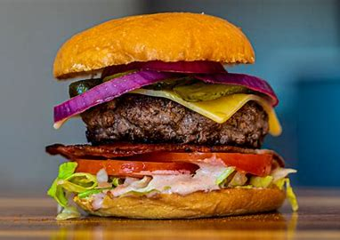

# Menu

## Burgery wołowe

|Lp. |                              Burger                                  | Cena |
|----|----------------------------------------------------------------------|------|
|1.  | CLASSIC(mięso wołowe 160g, ser, sałata, pomidor, sos BBQ)            | 18zł |
|2.  | NACHOS(mięso wołowe 160g, ser, sałata, nachos, sos salsa)            | 20zł |
|3.  | DEVIL(mięso wołowe 160g, ser, sałata, jalapeno, sos sambal)          | 22zł |
|4.  | MEGAMAX(mięso wołowe 320g, ser, sałata, pomidor, sos kentucky)       | 25zł |

## Burgery drobiowe

|Lp. |                              Burger                             | Cena |
|----|-----------------------------------------------------------------|------|
|1.  | CRISPY(mięso drobiowe 160g, sałata, pomidor, sos śmietanowy)    | 18zł |
|2.  | BACON(mięso wołowe 160g, ser, sałata, bekon, sos salsa)         | 20zł |
|3.  | HOTQRA(mięso drobiowe 160g, sałata, jalapeno, sos sambal)       | 22zł |

## Napoje

|Lp. |            Napój          | Cena |
|----|---------------------------|------|
|1.  | Sok pomarańczowy 330ml    |  5zł |
|2.  | Cola 330ml                |  5zł |
|3.  | Piwo 330ml                |  6zł |

## Dodatki

|Lp. |       Dodatek         | Cena |
|----|-----------------------|------|
|1.  | Krewetki 3szt         |  8zł |
|2.  | frytki 200g           |  8zł |
|3.  | Onion Rings 6szt      |  6zł |
